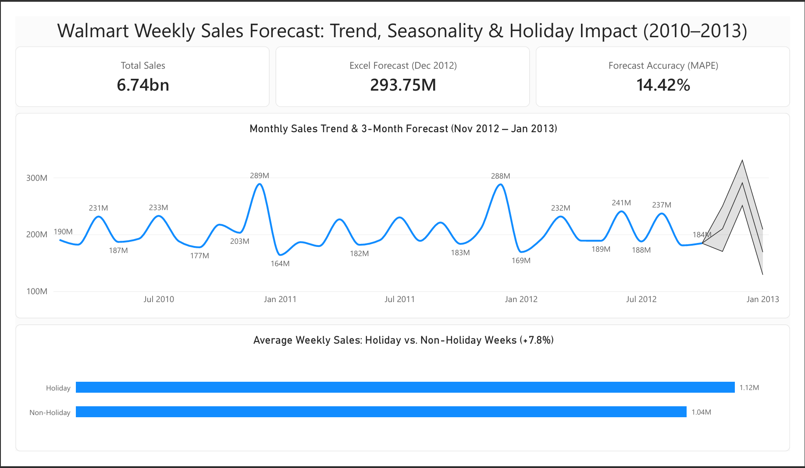

# Forecasting a $293M December Peak: Isolating the Real Driver Behind Walmart's Holiday Sales Surge
 
**A sales forecasting project using SQL, Excel, and Power BI to examine historical Walmart weekly sales, forecast near-term revenue, and identify what actually drives the holiday spike**
 
*Tools: SQL (PostgreSQL) | Excel | Power BI | DAX*
 
---
 
## Executive Summary
 
**The business question.** What will total company-wide weekly sales look like over the next 3 months, and how much of that pattern is driven by holiday periods? This question guided every stage of the project — from the SQL analysis used to understand historical patterns, to the choice of forecasting method, to the KPIs featured on the final dashboard.
 
**Trade-offs and assumptions.** 
- The dataset covers only 2.7 years of history — enough to confirm December/January seasonality twice, but limited for rarer or longer-cycle patterns.
- The dataset's `holiday_flag` for Christmas is mislabeled (Dec 31 instead of the pre-Christmas period), which limits its reliability as a standalone seasonality signal and was corrected for by breaking the holiday average apart by individual date.
- The forecast is company-wide and does not account for the large performance variation between individual stores.
 
**Key insights.** 
- Sales show a strong, consistent seasonal pattern — but only for December and January. December peaked at $288.76M (2010) and $288.08M (2011), nearly identical and dramatically above every other month both years, while January was consistently the lowest month immediately after. 
- The "holiday" effect is real but concentrated almost entirely in Thanksgiving week — averaged across all flagged holidays, the lift was only 7.8%, but breaking it down by individual date showed Thanksgiving alone spikes ~40%, while Super Bowl and Labor Day are only marginally above baseline.
- The forecast correctly reproduced the seasonal pattern with moderate accuracy: December 2012 was forecasted at $293.75M via Excel, closely matching real December 2010/2011 totals and cross-validated by an independent Power BI forecast, with backtesting producing a 14.4% MAPE.
 
**Three actionable recommendations.**
1. **Target Thanksgiving week specifically, not "holidays" broadly**, for promotional and staffing planning — it's the single strongest short-term driver identified, while other flagged holidays show only a marginal lift.
2. **Plan inventory and staffing for the December surge and the January drop-off** — the pattern is historically 40–50% above baseline in December, then falls sharply immediately after.
3. **Treat forecasts for non-seasonal, mid-year months with more caution, and consider extending the analysis to the store level** — backtesting showed weaker accuracy outside the Dec/Jan season, and the current forecast is company-wide, which may mask meaningful differences between locations.
---

## Dashboard



---

## Methodology

### 1. Data Loading & Cleaning (SQL)
- Loaded raw CSV into PostgreSQL, converting mixed date formats (`DD-MM-YYYY` with inconsistent separators) into proper `DATE` types.
```sql
create table weekly_sales_raw(
	store INT,
    sale_date_text VARCHAR(20),
    weekly_sales NUMERIC(12,2),
    holiday_flag INT,
    temperature NUMERIC(5,2),
    fuel_price NUMERIC(5,3),
    cpi NUMERIC(10,4),
    unemployment NUMERIC(5,2)
);

CREATE TABLE weekly_sales AS
SELECT
    store,
    TO_DATE(sale_date_text, 'DD-MM-YYYY') AS sale_date,
    weekly_sales,
    holiday_flag::BOOLEAN,
    temperature,
    fuel_price,
    cpi,
    unemployment
FROM weekly_sales_raw;
```
- Added a composite primary key (`store`, `sale_date`) to enforce uniqueness.

```sql
-- Add the composite key back (store + date together must be unique)
alter table weekly_sales
add primary key (store,sale_date);

-- Each store should only have one row per week
select store,sale_date,count(*)
from weekly_sales
group by store,sale_date
having count(*) > 1;
```
- Verified data quality: zero missing values, zero impossible values (negative sales, out-of-range percentages), and confirmed all 45 stores had complete, even history (143 weeks each).

```sql
-- Check 1: Missing values
SELECT
    COUNT(*) FILTER (WHERE store IS NULL) AS missing_store,
    COUNT(*) FILTER (WHERE sale_date IS NULL) AS missing_date,
    COUNT(*) FILTER (WHERE weekly_sales IS NULL) AS missing_sales,
    COUNT(*) FILTER (WHERE holiday_flag IS NULL) AS missing_holiday_flag,
    COUNT(*) FILTER (WHERE temperature IS NULL) AS missing_temp,
    COUNT(*) FILTER (WHERE fuel_price IS NULL) AS missing_fuel,
    COUNT(*) FILTER (WHERE cpi IS NULL) AS missing_cpi,
    COUNT(*) FILTER (WHERE unemployment IS NULL) AS missing_unemployment
FROM weekly_sales;

-- Check 2: Negative or impossible values
SELECT * FROM weekly_sales WHERE weekly_sales <= 0;
SELECT * FROM weekly_sales WHERE fuel_price <= 0;
SELECT * FROM weekly_sales WHERE unemployment < 0 OR unemployment > 30;
SELECT * FROM weekly_sales WHERE temperature < -30 OR temperature > 120;  -- extreme outlier bounds, not "negative = bad"
SELECT * FROM weekly_sales WHERE cpi <= 0;

-- Check 3: Row count per store
select store,count(*) as weeks_recorded
from weekly_sales
group by store;
```

### 2. Exploratory & Business-Question SQL Analysis
- Calculated monthly sales trends across the full time range.

```sql
-- How has total company-wide revenue changed month by month?
-- Is there a repeating pattern across the year?
select
	date_trunc('month',sale_date) as month,
	sum(weekly_sales) as total_sales
from weekly_sales
group by date_trunc('month',sale_date)
order by month;
```
- Compared average sales on holiday vs. non-holiday weeks.

```sql
-- Are sales actually higher on the specific weeks marked as holidays, compared to regular weeks?
-- and if so, by how much?
select
	holiday_flag,
	avg(weekly_sales) as avg_weekly_sales,
	count(*) as num_weeks
from weekly_sales
group by holiday_flag;
```
- Broke down sales by individual holiday date to identify which specific holidays drive the effect.

```sql
-- The overall 'holiday effect' was only 8%
-- Is that because every holiday adds a small bump?
-- Or because one big holiday is doing most of the work and the rest add almost nothing?
select 
	sale_date,
	avg(weekly_sales)
from weekly_sales
where holiday_flag = 'true'
group by sale_date
order by sale_date;
```
- Ran a year-over-year comparison to confirm which monthly patterns are genuinely seasonal (repeat every year) vs. noise (don't repeat consistently).

```sql
-- Does the same monthly pattern (December high, January low) repeat consistently every year?
-- Or could 2010's pattern have been a one-time fluke?
select
	extract (year from sale_date) as year,
	extract (month from sale_date) as month,
	sum(weekly_sales) as total_sales
from weekly_sales
group by 
	extract (year from sale_date),
	extract (month from sale_date)
order by
	month,year;
```

### 3. Forecasting (two independent methods, for comparison)
- **Excel:** [Walmart_Forecast.xlsx](excel/walmart_forecast.xlsx) — `FORECAST.ETS()` with explicit 12-month seasonality, plus `FORECAST.ETS.CONFINT()` for a 95% confidence interval.

- **Power BI:** [walmart_sales_dashboard.pbix](dashboard/walmart_sales_dashboard.pbix) — built-in forecast visual (Analytics pane), same 3-month horizon and seasonality setting, for cross-validation against the Excel result.


### 4. Accuracy Validation (Backtesting)
- Held out the last 3 known months (Aug–Oct 2012) from the training data.
- Forecasted those months using only prior history, then compared forecasted vs. actual values.
- Calculated Mean Absolute Percentage Error (MAPE) to quantify forecast reliability.

### 5. Dashboard (Power BI)
- KPI cards: Total Sales, Excel Forecast (Dec 2012), Forecast Accuracy (MAPE).
- Line chart: historical monthly trend with 3-month forecast and confidence band.
- Bar chart: average weekly sales, holiday vs. non-holiday weeks.

---

## A Closer Look: The Holiday Finding
This was the sharpest insight in the project. Averaging all holiday weeks together gave a modest 7.8% lift — too small to explain the ~50% December spike seen in the monthly trend. Breaking the average back apart by individual holiday date revealed why: Thanksgiving week alone averages ~$1.46M–$1.48M (a ~40% spike), while Super Bowl and Labor Day are only marginally above the $1.04M non-holiday baseline — and the flagged "Christmas" date (Dec 31) is actually below average, since it lands after the real shopping rush. See sql/04_holiday_breakdown_by_date.sql for the full script and sql/03_holiday_vs_nonholiday.sql for the initial blended comparison.

---

## Data Source & License

**Dataset**: Walmart Weekly Sales (2010–2012)
**Source**: [Kaggle — Walmart Dataset](https://www.kaggle.com/datasets/yasserh/walmart-dataset)
**License**: CC0: Public Domain
**Size**: 6,435 rows, 45 stores, weekly sales from February 2010 to November 2012 (~2.7 years)

**Columns**: Store, Date, Weekly_Sales, Holiday_Flag, Temperature, Fuel_Price, CPI, Unemployment

---

## Repository Structure

```
end-to-end-sales-forecasting-analysis/
│
├── README.md
│
├── dataset/
│   └── Walmart.csv
│
├── sql/
│   ├── Walmart_Sales_Forecast_Trend_Seasonality_and_Holiday_Impact.sql
│   └── outputs/
│       ├── monthly_trend.csv
│       ├── holiday_vs_nonholiday.csv
│       ├── holiday_breakdown_by_date.csv
│       └── year_over_year.csv
│
├── excel/
│   └── Walmart_Forecast.xlsx
│
├── dashboard/
│   ├── walmart_sales_dashboard.pbix
│   └── images/
│       └── dashboard_screenshot.png
```

Full SQL scripts and the Excel/Power BI files are included above for anyone who wants to verify or extend the analysis. The sections below summarize the approach and results; they're not a full step-by-step log.

---

## Tools Used

SQL (PostgreSQL) · Excel ( FORECAST.ETS(), FORECAST.ETS.CONFINT() ) · Power BI (DAX measures, forecast visuals, dashboard design)

---

## 👤 Author

Yasir Shah | Data Analyst | SQL | Power BI | Excel

- www.linkedin.com/in/yasir-shah-2364183b3
- https://github.com/yasirshah-analyst
- shahyasir443@gmail.com
